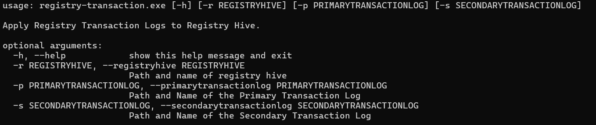

# Registry-Transactions

## Summary
This program will apply the registry hive transaction logs to the registry hive.

## Requirements
This project requires several additional modules. You can install them with the provided requirements.txt file as follows:

```bash
python3 -m pip install -r requirements.txt
```
This has been tested on Pythin 3.9.

## Command Line


If the secondary transaction log file is zero (0) bytes in lenght then it will be ignored

If the primary transaction log file is zero (0) bytes in length the program will exit and not update the registry hive


## Need Help?
If you have any questions/comments/suggestions please let me know.  [Create an issue](https://github.com/markmckinnon/Autopsy-Plugins/issues/new).  Enjoy!


